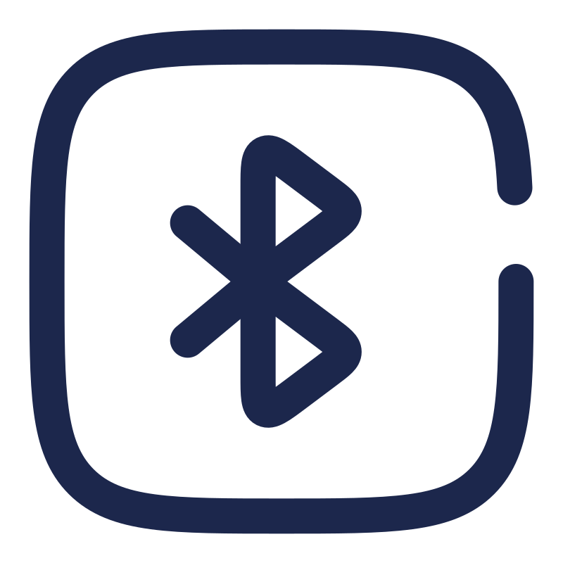

# Général Midi Boop

**Turn a pile of DIY MIDI instruments into a real orchestra — from a Raspberry Pi, with no internet required.**

[](https://nodejs.org/)
[](#license)
[](https://www.raspberrypi.org/)

Général Midi Boop is a complete MIDI orchestration system designed for **beginners building DIY MIDI instruments**. Plug in your home-made or off-the-shelf instruments, point a standard MIDI file at them, and the system automatically adapts the music to what each instrument can actually play — then conducts the whole ensemble in sync.

It is built to run **standalone on a Raspberry Pi without any internet connection**. Everything is driven from a modern, touch-friendly web interface you reach from a phone, tablet or laptop on the same network — or directly from the Pi's own WiFi hotspot.


## Quick install (Raspberry Pi)

```bash
git clone https://github.com/glloq/General-Midi-Boop.git
cd General-Midi-Boop
chmod +x scripts/Install.sh
./scripts/Install.sh
```

Then open the interface at `http://<Raspberry-Pi-IP>:8080`.

The installer sets up Node.js, system dependencies, auto-start on boot and (optionally) Bluetooth — see [docs/INSTALLATION.md](./docs/INSTALLATION.md) for detailed configuration and other platforms.

## Highlights

- Connect instruments over **USB, Bluetooth LE, network (RTP-MIDI, experimental) or physical MIDI IN/OUT** on the Raspberry Pi GPIO.
- **Conduct up to 16 instruments at once**, with per-device latency compensation and an optional MIDI clock.
- **Automatic routing** of MIDI channels to the best-suited connected instrument.
- **Automatic adaptation** of any MIDI file to each instrument's note range and polyphony.
- **Play live** from a virtual keyboard, and **build loops and arrangements** from the Loop manager.
- **Preview** any loop or MIDI file with the original sound or the instrument-adapted rendering, with optional per-instrument SoundFonts.
- **Specialized virtual keyboards** that match each instrument (fretboard, drum pad, harp, accordion…).
- **Lighting control** synced to playback, from simple LED strips to professional DMX.
- **Built to run on its own**: offline-first, one-click WiFi hotspot, one-button full system update, tablet-ready UI, 28 languages.

## Connect any instrument

 &nbsp;  &nbsp;  &nbsp; 

Whatever you built, there's a way in:

- **USB MIDI** — automatic detection and hot-plug.
- **Bluetooth LE MIDI** — scan and pair wireless instruments; inbound BLE notes are routed like any other input.
- **Network MIDI (RTP-MIDI)** — *experimental.* Connect over WiFi or Ethernet. The current RTP-MIDI session is a **simplified, not-yet-conformant AppleMIDI implementation** (no invitation handshake, clock synchronisation or journal/recovery) and is not guaranteed to interoperate with macOS Network MIDI or other AppleMIDI peers yet. Reported as `degraded` on the health endpoint.
- **Physical MIDI IN/OUT via GPIO** — wire real 5-pin MIDI to the Raspberry Pi at 31250 baud using a MIDI HAT *or* a simple DIY circuit. Multiple hardware UARTs are supported (up to 6 on a Pi 4), with Running Status and SysEx, and a bounded, back-pressured write queue on output. See [docs/GPIO_MIDI_WIRING.md](./docs/GPIO_MIDI_WIRING.md) for HAT and DIY wiring.

> **Capability health.** Optional transports load only when their native
> dependencies are present, so a running server may not expose every
> transport above. Query `GET /api/capabilities` (or the `capabilities`
> block in `/api/health`) for the live `ready` / `degraded` / `failed` /
> `disabled` status of each subsystem.
>
> **File support.** Standard MIDI files in **format 0 and 1 with PPQ
> timing** are supported, including SysEx (GM/GS/XG resets, Master Volume).
> **Format 2** and **SMPTE (frame-based) timing** are explicitly rejected
> rather than played with an incorrect chronology.

Each instrument gets its own settings — note range, polyphony, type, latency, tuning and more — defined once and persisted.

## Drive a whole orchestra


Point the system at a standard MIDI file and it does the conducting for you:

- **Automatic channel routing** — each MIDI channel is analysed (melody, bass, harmony, drums) and assigned to the most compatible connected instrument, with a single channel split across several instruments when needed.
- **Automatic file adaptation** — notes outside an instrument's range are transposed or folded back in, polyphony is reduced to what the instrument can play, and General MIDI drums are remapped to the available pads.
- **Up to 16 instruments simultaneously** — the full 16 MIDI channels, played together.
- **Per-device latency compensation** — measure each instrument's real delay (including a microphone-based calibration) so everything lands on the beat.
- **Optional MIDI clock** — keep clock-driven instruments locked to the tempo.

## Play, loop & arrange


- **Play live** from the virtual keyboard, also reachable from the Loop manager's **Live** tab.
- **Build loops and arrangements** in the Loop manager: a searchable **Library**, a trigger **Pad**, a **Live** performance view, and a multi-track **Arranger** timeline.
- **Preview before you commit** — listen to any loop or MIDI file and switch between the original (General MIDI) sound and the instrument-adapted rendering.
- **Realistic previews** — assign a custom **SF2 SoundFont** to an instrument so the preview sounds closer to the real thing.

## Specialized virtual keyboards

The on-screen keyboard adapts to the selected instrument instead of always showing piano keys — so playing and editing matches how the real instrument works.

| | |
|---|---|
|  |  |
|  |  |

Layouts include standard piano, string fretboards, drum/percussion pads, harp, accordion, harmonica, mallets, kalimba, steel drum and more — chosen automatically from each instrument's capabilities.

## Built-in MIDI editor


A multi-mode editor with four specialized views over a shared transport and per-channel routing:

- **Piano Roll** — add / move / resize notes, 16 coloured channels, snap grid.
- **Tablature** — string instruments with bidirectional MIDI ↔ tab conversion.
- **Drums** — grid-based GM drum pattern editor.
- **Wind** — articulation and breath dynamics for wind instruments.

A dedicated touch mode (separate Move / Add / Resize controls) makes it usable on tablets. See [docs/MIDI_EDITOR.md](./docs/MIDI_EDITOR.md).

## Lighting


Stage and ambient lighting synchronized with MIDI playback, driven straight from the Raspberry Pi:

- **GPIO LED strips** (WS2812/NeoPixel and on/off pins), plus **ArtNet DMX**, **sACN/E1.31**, **OSC**, **HTTP/WLED** and **MQTT** drivers.
- A rules engine with **MIDI-learn**: trigger colour and brightness from note ranges, velocity and CC values.

## Built to run on its own

This is meant to live on a Pi backstage, not next to a developer's laptop:

- **Offline-first** — all sounds and assets are stored locally; no internet needed at runtime.
- **One-click WiFi hotspot** — turn the Pi into its own access point from the System settings modal (SSID, password, band), with a captive portal so a tablet connects straight to the interface.
- **One-button full system update** — update the whole system in a few minutes from the settings, with live progress and automatic restart.
- **Touchscreen / tablet ready** — responsive, multi-touch UI.
- **28 languages**, including translated MIDI instrument names: English, French, Spanish, German, Italian, Portuguese, Dutch, Polish, Russian, Chinese, Japanese, Korean, Turkish, Hindi, Bengali, Thai, Vietnamese, Czech, Danish, Finnish, Greek, Hungarian, Indonesian, Norwegian, Swedish, Ukrainian, Esperanto, Tagalog.

## Roadmap / in progress

The project already includes tooling for **hand and finger management** on string and keyboard instruments — hand-position editing, feasibility simulation and finger/fret visualization — used to keep adapted parts physically playable.

Planned evolutions:

- **MIDI-message-driven lighting on instruments and peripherals** — extend lighting control so the instrument's own lights respond to MIDI.
- **Humanoid-hand control** — drive robotic hands for string and keyboard instruments. See [docs/HUMANOID_HAND_MANAGEMENT.md](./docs/HUMANOID_HAND_MANAGEMENT.md) and [docs/HAND_VISUALIZATION.md](./docs/HAND_VISUALIZATION.md).

## Development

Prerequisites: **Node.js >= 20.0.0**.

```bash
git clone https://github.com/glloq/General-Midi-Boop.git
cd General-Midi-Boop
npm install
```

Common commands:

- `npm run dev` — development server with hot reload
- `npm start` — production server
- `npm test` — backend tests (Jest)
- `npm run test:frontend` — frontend tests (Vitest)
- `npm run lint` — ESLint
- `npm run format` — Prettier
- `npm run build` — Vite production build

Deployment options: direct Node.js (`npm start`), **PM2** for production with auto-restart, or **Docker** (`docker-compose up -d`). See [docs/INSTALLATION.md](./docs/INSTALLATION.md).

## Documentation

- **[Project Wiki](https://github.com/glloq/General-Midi-Boop/wiki)** — guided tour, usage, troubleshooting (sources tracked in [`wiki/`](./wiki))
- [Installation Guide](./docs/INSTALLATION.md)
- [Architecture](./docs/ARCHITECTURE.md)
- [API Reference](./docs/API.md)
- [Auto-Assignment System](./docs/AUTO_ASSIGNMENT.md)
- [GPIO MIDI Wiring](./docs/GPIO_MIDI_WIRING.md)
- [MIDI Editor](./docs/MIDI_EDITOR.md)
- [SysEx Identity Protocol](./docs/SYSEX_IDENTITY.md)
- [Contributing](./CONTRIBUTING.md)
- [Changelog](./CHANGELOG.md)

## License

Released under the **MIT License**.
